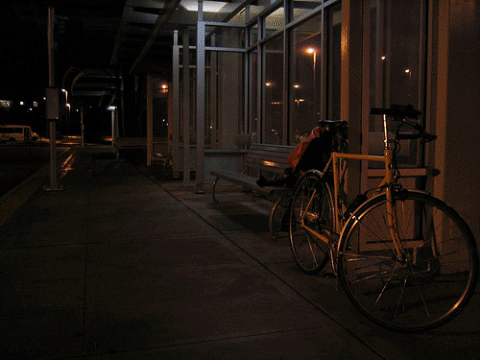

## Description

The ExDark dataset can be downloaded at [this https URL](https://drive.google.com/file/d/1BHmPgu8EsHoFDDkMGLVoXIlCth2dW6Yx/view?usp=sharing) (size = 1.5Gb).

## Dataset Information

The images are kept in individual class folders following the image class labels:
1. Bicycle - 652 images
2. Boat - 679 images
3. Bottle - 547 images
4. Bus - 527 images
5. Car - 638 images
6. Cat - 735 images
7. Chair - 648 images
8. Cup - 519 images
9. Dog - 801 images
10. Motorbike - 503 images
11. People - 609 images
12. Table - 505 images 

Total : 7,363 images

For the experiments in our paper that involves training, the data are split as follows:

(a) Training - 3,000 images (250 images per class)

(b) Validation - 1,800 images (150 images per class)

(c) Testing - 2,563 images

* See [annotation](https://github.com/cs-chan/Exclusively-Dark-Image-Dataset/tree/master/Groundtruth) for further details.

Note:
1. The ExDark dataset can be used only for non-commercial research purpose.

2. For commercial purpose usage, please contact Dr. Chee Seng Chan at `cs.chan at um.edu.my`
