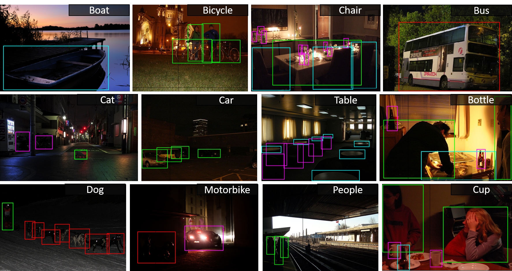

# Description 

The groundtruth of ExDark dataset can be downloaded at [this https URL](https://drive.google.com/file/d/1P3iO3UYn7KoBi5jiUkogJq96N6maZS1i/view?usp=sharing) (4.2Mb).

## Groundtruth Details

There are 12 folders labeled with the object classes containing object bounding box annotations in '.txt' files labeled with the corresponding image name. 

The annotations are generated using Piotr's Computer Vision Matlab Toolbox ([PMT](https://pdollar.github.io/toolbox/))

The format in each '.txt' is:

(a) First 16 characters : Annotation tool data (unused)

(b) 1st column : Object class name

(c) 2nd-5th column : Bounding box coordinates [l t w h]
    
    l - pixel number from left of image
    t - pixel number from top of image
    w - width of bounding box
    h - height of bounding box

(d) 6th-12th column : occlusion and orientation annotation (unused)

(e) For images with more than 1 object annotated, (b)-(d) is repeated

## Experiment Settings

The [imageclasslist.txt](https://github.com/cs-chan/Exclusively-Dark-Image-Dataset/blob/master/Groundtruth/imageclasslist.txt) contains the list of image class annotations and experimental splits used in our paper.

The format is:

(a) 1st column : Image name

(b) 2nd column : Object class label 

    Bicycle(1), Boat(2), Bottle(3), Bus(4), Car(5), Cat(6), Chair(7), Cup(8), Dog(9), Motorbike(10), People(11), Table(12)

(c) 3rd column : Lighting type 

    Low(1), Ambient(2), Object(3), Single(4), Weak(5), Strong(6), Screen(7), Window(8), Shadow(9), Twilight(10)
    

(d) 4th column : Indoor/Outdoor 
    
    Indoor(1), Outdoor(2)

(e) 5th column : Experiment sets 
    
    Training(1), Validation(2), Testing(3)

