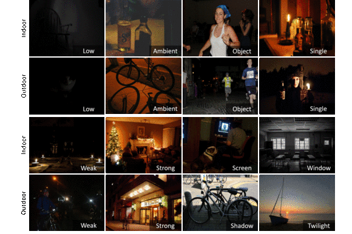

# Exclusively Dark (ExDark) Image Dataset

Coming soon....

## Description

Exclusively Dark (ExDARK) dataset is a collection of 7,363 low-light images from very low-light environments to twilight (i.e 10 different conditions), and 12 object classes (as to PASCAL VOC) annotated on both image class level and local object bounding boxes. 

