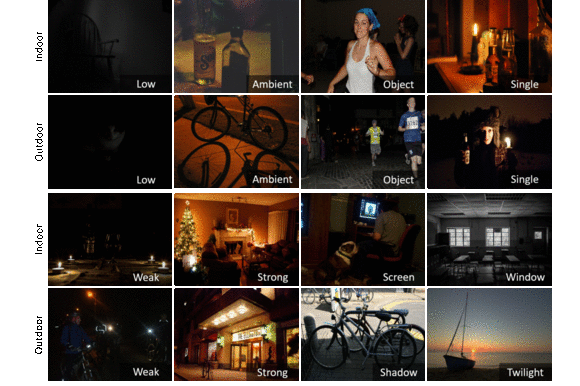

# Exclusively Dark (ExDark) Image Dataset

Released on May 29, 2018

## Description

In order to facilitate a new object detection and image enhancement research, we introduce the Exclusively Dark (ExDark) dataset [CVIU (under review)](https://arxiv.org/abs/1805.11227). Exclusively Dark (ExDARK) dataset is a collection of 7,363 low-light images from very low-light environments to twilight (i.e 10 different conditions) with 12 object classes (as to PASCAL VOC) annotated on both image class level and local object bounding boxes. 




## Citation
If you find this dataset useful for your research, please cite
```
@article{Exdark,
  title={Getting to Know Low-light Images with The Exclusively Dark Dataset},
  author={Loh, Yuen Peng and Chan, Chee Seng},
  journal={arXiv preprint arXiv:1805.11227},
  year={2018}
}
```

## Feedback
Suggestions and opinions of this dataset (both positive and negative) are greatly welcome. Please contact the authors by sending email to
`lexloh2009 at hotmail.com`or `cs.chan at um.edu.my`.

## Lisense and Copyright
The project is open source under BSD-3 license (see the ``` LICENSE ``` file). Codes can be used freely only for academic purpose.

Copyright 2018, Center of Image and Signal Processing, Faculty of Computer Science and Information Technology, University of Malaya.
