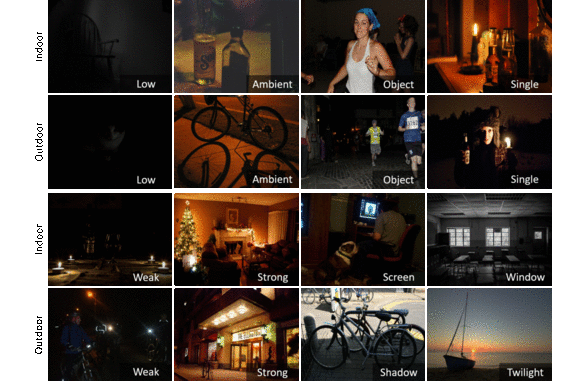
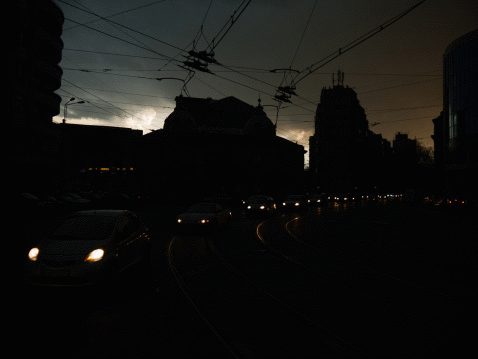

# Exclusively Dark (ExDark) Image Dataset (Official Site)
[ArXiv](http://cs-chan.com/doc/cviu.pdf)

Updated on Sept 02, 2022 (Updated the dataset link)

Updated on June 02, 2019 (Code for low-light image enhancement is released)

Updated on Oct. 31, 2018 (Accepted for publication in CVIU)

Released on May 29, 2018

## Description

In order to facilitate a new object detection and image enhancement research particularly in the low-light environment, we introduce the Exclusively Dark (ExDark) dataset [(CVIU2019)](http://cs-chan.com/doc/cviu.pdf). The Exclusively Dark (ExDARK) dataset is a collection of 7,363 low-light images from very low-light environments to twilight (i.e 10 different conditions) with 12 object classes (similar to PASCAL VOC) annotated on both image class level and local object bounding boxes. 



## Source Code 
The source code for our work on low-light image enhancement is now available. Please refer to the [SPIC](https://github.com/cs-chan/Exclusively-Dark-Image-Dataset/tree/master/SPIC) folder.

  


## Citation
If you find this dataset useful for your research, please cite
```bibtex
@article{Exdark,
  title = {Getting to Know Low-light Images with The Exclusively Dark Dataset},
  author = {Loh, Yuen Peng and Chan, Chee Seng},
  journal = {Computer Vision and Image Understanding},
  volume = {178},
  pages = {30-42},
  year = {2019},
  doi = {https://doi.org/10.1016/j.cviu.2018.10.010}
}
```

## Feedback
Suggestions and opinions on this dataset (both positive and negative) are greatly welcomed. Please contact the authors by sending an email to
`lexloh2009 at hotmail.com` or `cs.chan at um.edu.my`.

## License, Dataset Terms and Rights

ExDark contains different categories of material.
Different terms apply to different components:

| Material | Applicable terms |
| --- | --- |
| Original software code and scripts owned by the ExDark authors | Applicable software licence stated for that component. See the relevant `LICENSE` file. |
| ExDark annotations, bounding boxes, class labels, metadata, dataset splits and related project-created documentation | See `DATASET_TERMS.md`. |
| Underlying photographs, movie frames, images originating from third-party websites or third-party datasets, and other third-party material | Not licensed under the ExDark Dataset Research Use Terms unless expressly stated. Separate third-party rights may apply. |

### Academic research use

The ExDark Dataset Materials, as defined in
`DATASET_TERMS.md`, may be used for non-commercial academic
research, education, benchmarking and scholarly publication
subject to those terms.

Where a project is carried out by, with, or under the sponsorship of a for-profit entity, written confirmation from the Licensor is required before relying on the academic-use permission.

### Commercial use

Commercial use of ExDark Dataset Materials controlled by the Licensor requires prior written permission.

Nothing in these terms grants commercial or other rights in underlying third-party images or other third-party materials.

For permission requests, contact:
Dr. Chee Seng Chan at `cs.chan at um.edu.my`.

### Rights notice

Permissions are granted only to the extent that the Licensor owns or is authorised to grant the relevant rights.
See `RIGHTS_NOTICE.md`.

These clarified terms apply prospectively from 01 October 2026 and do not purport to revoke or determine the scope of rights validly granted under an earlier version of this repository.

ExDark annotations, metadata and original project-created dataset materials: © 2018–2026 Chee Seng Chan.
