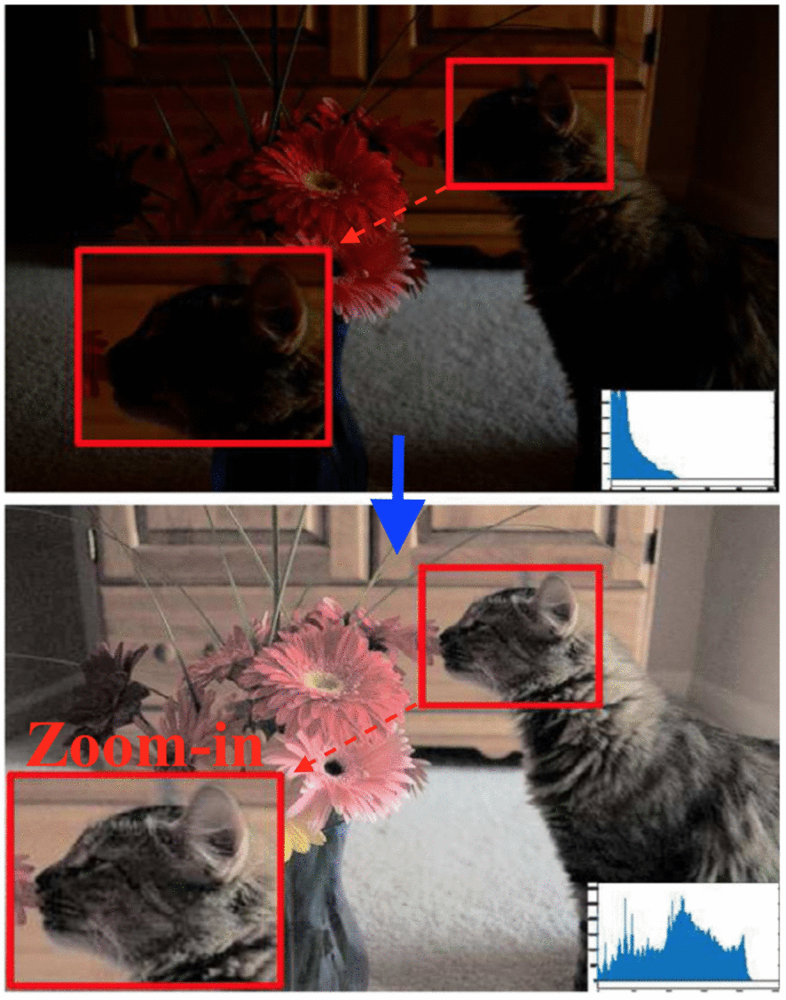

# Low-light Image Enhancement
[ArXiv](http://cs-chan.com/doc/SPIC2019.pdf)

### Official Matlab implementation of the paper: "Low-light Image Enhancement using Gaussian Process for Features Retrieval"

#### Signal Processing: Image Communication 2019

Released on June 1, 2019

## Description

In this work, we propose to model low-light enhancement as a set of localized functions using Gaussian Process that is trained at runtime using data from a simple Convolutional Neural Network (CNN) to provide the necessary feature information as reference. The CNN is in turn trained using large amount of synthetic data,
based upon the luminance distribution of real world low-light images to learn the relationship between features and pixels. 

   


## Citation

Please cite the following paper if you use this repository in your reseach:
```bibtex
@article{loh2019low,
  title = {Low-light image enhancement using Gaussian Process for features retrieval},
  author = {Loh, Yuen Peng and Liang, Xuefeng and Chan, Chee Seng},
  journal = {Signal Processing: Image Communication},
  volume = {74},
  pages = {175--190},
  year = {2019},
  publisher = {Elsevier}
}
```

## Dependencies

The codes are implemented in MATLAB using the prior version of [MatConvNet](http://www.vlfeat.org/matconvnet/) and the [Gaussian Process for Machine Learning](http://www.gaussianprocess.org/gpml/code/matlab/doc/index.html) toolboxes.

## Installation and Running

1. Extract GPR_v1.1.zip

2. Extract matconvnet-1.0-beta20.tar.gz
   - run vl_compilenn
   - run vl_setupnn
   
   (for problems installing the toolbox, please refer to [MatConvNet](http://www.vlfeat.org/matconvnet/))

3. Run demo.m

## Feedback
Suggestions and opinions of this work (both positive and negative) are greatly welcomed. Please contact the authors by sending an email to
`lexloh2009 at hotmail.com`or `cs.chan at um.edu.my`.

## License

The SPIC folder contains original project code and bundled or referenced third-party software components.

The licence applicable to each component is determined by the licence file and notices accompanying that component. Third-party software retains its original licence.

The current `SPIC/LICENSE` file contains GNU GPL v3 terms. Accordingly, users should not rely on an inconsistent
“BSD-3-Clause” or “academic use only” statement in this README.

For licensing questions concerning original SPIC code owned by the authors, please contact Dr. Chee Seng Chan at
`cs.chan at um.edu.my`.
